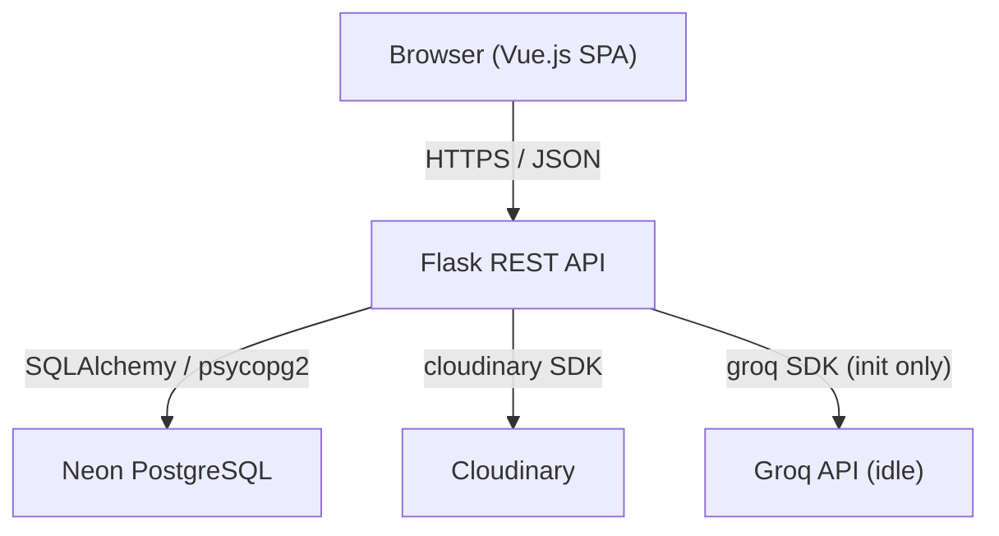

# Design Document: JobTracker

## Overview

JobTracker is a single-page application (SPA) that lets authenticated users track job applications through the hiring pipeline. The system is composed of four layers:

1. **Vue.js SPA** — served statically, handles all UI rendering, routing, and state management
2. **Flask REST API** — stateless backend that enforces business rules and orchestrates data access
3. **Neon (PostgreSQL)** — persistent relational store for users and job entries
4. **Cloudinary** — cloud object storage for file attachments (PDF, PNG, JPG, JPEG)

The Groq API client is wired up at startup but remains idle; it is reserved for future AI features and makes no requests during normal operation.

Authentication is JWT-based. The frontend stores the token in `localStorage` and attaches it as a `Bearer` token on every protected request. Tokens expire after 24 hours, at which point the frontend redirects to the login page.

---

## Architecture



### Request Lifecycle

1. The browser sends an HTTP request with `Authorization: Bearer <jwt>`.
2. Flask validates the JWT signature and expiry via a `@require_auth` decorator.
3. The relevant service layer (Auth, Job, File, Stats) executes the business logic.
4. Responses are JSON; errors follow a consistent `{ "error": "<message>" }` envelope.

### Deployment Topology

| Component | Host |
|-----------|------|
| Vue.js SPA | Static hosting (e.g., Vercel / Netlify) |
| Flask API | WSGI server (e.g., Gunicorn on Render / Railway) |
| Database | Neon serverless PostgreSQL |
| File storage | Cloudinary |

---

## Components and Interfaces

### Backend Components

#### Auth_Service

Handles registration, login, and token issuance.

| Endpoint | Method | Auth | Description |
|----------|--------|------|-------------|
| `/api/auth/register` | POST | None | Register a new user |
| `/api/auth/login` | POST | None | Authenticate and receive JWT |

**Register request body:**
```json
{ "email": "user@example.com", "password": "secret123" }
```

**Login response body:**
```json
{ "token": "<jwt>", "user": { "id": 1, "email": "user@example.com" } }
```

#### Job_Service

Full CRUD for job entries. All endpoints require a valid JWT.

| Endpoint | Method | Auth | Description |
|----------|--------|------|-------------|
| `/api/jobs` | GET | JWT | List all job entries for the authenticated user |
| `/api/jobs` | POST | JWT | Create a new job entry |
| `/api/jobs/<id>` | GET | JWT | Retrieve a single job entry |
| `/api/jobs/<id>` | PUT | JWT | Update a job entry |
| `/api/jobs/<id>` | DELETE | JWT | Delete a job entry |

**Job entry request body (POST/PUT):**
```json
{
  "company_name": "Acme Corp",
  "job_title": "Software Engineer",
  "status": "Applied",
  "application_date": "2024-01-15",
  "location": "Remote",
  "salary_min": 90000,
  "salary_max": 120000,
  "job_url": "https://example.com/job",
  "notes": "Referred by a friend",
  "file": "<multipart file or null>"
}
```

#### File_Service

Handles Cloudinary uploads and deletions. Called internally by Job_Service.

- Accepts: PDF, PNG, JPG, JPEG
- Max size: 10 MB
- On upload: returns a Cloudinary secure URL stored in `job_entries.file_url`
- On job deletion: deletes the associated Cloudinary asset by public ID

#### Stats_Engine

Computes aggregated statistics for the authenticated user.

| Endpoint | Method | Auth | Description |
|----------|--------|------|-------------|
| `/api/stats` | GET | JWT | Return dashboard statistics |

**Stats response body:**
```json
{
  "total": 24,
  "interview": 5,
  "offer": 2,
  "rejected": 8,
  "by_status": {
    "Applied": 9, "Phone Screen": 3, "Interview": 5,
    "Offer": 2, "Rejected": 8, "Withdrawn": 0
  },
  "weekly_counts": [
    { "week": "2024-W01", "count": 3 },
    ...
  ]
}
```

#### Groq_Client

Initialized at application startup using the `GROQ_API_KEY` environment variable. No routes or service calls reference it during normal operation. It is exposed as a module-level singleton so future features can import it without additional setup.

```python
# groq_client.py
from groq import Groq
import os

groq_client = Groq(api_key=os.environ.get("GROQ_API_KEY"))
```

### Frontend Components

```
src/
├── main.js                  # App bootstrap, router, axios defaults
├── router/index.js          # Vue Router routes + navigation guard
├── store/                   # Pinia stores
│   ├── auth.js              # JWT storage, login/logout actions
│   └── jobs.js              # Job entries state, CRUD actions
├── views/
│   ├── LoginView.vue        # Login page
│   ├── RegisterView.vue     # Registration page
│   ├── DashboardView.vue    # Stats cards + charts
│   └── JobListView.vue      # Job list + detail/edit panel
├── components/
│   ├── layout/
│   │   └── AppSidebar.vue   # Persistent sidebar with nav links
│   ├── dashboard/
│   │   ├── StatCard.vue     # Individual stat card
│   │   ├── StatusChart.vue  # Doughnut chart by status
│   │   └── WeeklyChart.vue  # Bar chart — applications per week
│   ├── jobs/
│   │   ├── JobList.vue      # Scrollable list of job entries
│   │   ├── JobListItem.vue  # Single row in the list
│   │   ├── JobDetail.vue    # Full detail panel
│   │   ├── JobForm.vue      # Create / edit form (shared)
│   │   └── DeleteDialog.vue # Confirmation dialog
│   └── common/
│       ├── LoadingSpinner.vue
│       └── ErrorBanner.vue
```

#### Vue Router

```javascript
const routes = [
  { path: '/login',    component: LoginView,    meta: { public: true } },
  { path: '/register', component: RegisterView, meta: { public: true } },
  { path: '/dashboard', component: DashboardView },
  { path: '/jobs',      component: JobListView },
  { path: '/',          redirect: '/dashboard' },
]
```

A global navigation guard checks for a valid JWT in `localStorage`. If absent or expired, it redirects to `/login`.

#### Pinia Stores

**auth.js**
- `token` — raw JWT string
- `user` — decoded user object
- `login(email, password)` — calls `/api/auth/login`, stores token
- `logout()` — clears token, redirects to `/login`
- `isAuthenticated` — computed getter

**jobs.js**
- `entries` — array of job entry objects
- `selected` — currently viewed/edited entry
- `fetchAll()`, `create(data)`, `update(id, data)`, `remove(id)`
- `stats` — cached stats object
- `fetchStats()`

---

## Data Models

### Database Schema

#### `users` table

| Column | Type | Constraints |
|--------|------|-------------|
| `id` | SERIAL | PRIMARY KEY |
| `email` | VARCHAR(255) | UNIQUE, NOT NULL |
| `password_hash` | VARCHAR(255) | NOT NULL |
| `created_at` | TIMESTAMPTZ | DEFAULT NOW() |

#### `job_entries` table

| Column | Type | Constraints |
|--------|------|-------------|
| `id` | SERIAL | PRIMARY KEY |
| `user_id` | INTEGER | FK → users.id, NOT NULL |
| `company_name` | VARCHAR(255) | NOT NULL |
| `job_title` | VARCHAR(255) | NOT NULL |
| `status` | VARCHAR(50) | NOT NULL, CHECK IN enum values |
| `application_date` | DATE | NULLABLE |
| `location` | VARCHAR(255) | NULLABLE |
| `salary_min` | NUMERIC(12,2) | NULLABLE |
| `salary_max` | NUMERIC(12,2) | NULLABLE |
| `job_url` | TEXT | NULLABLE |
| `notes` | TEXT | NULLABLE |
| `file_url` | TEXT | NULLABLE |
| `created_at` | TIMESTAMPTZ | DEFAULT NOW() |
| `updated_at` | TIMESTAMPTZ | DEFAULT NOW() |

#### `Application_Status` Enum

Valid values: `Applied`, `Phone Screen`, `Interview`, `Offer`, `Rejected`, `Withdrawn`

Enforced at the database level via a CHECK constraint and at the API level via input validation.

### Python Data Classes (SQLAlchemy models)

```python
class User(Base):
    __tablename__ = "users"
    id            = Column(Integer, primary_key=True)
    email         = Column(String(255), unique=True, nullable=False)
    password_hash = Column(String(255), nullable=False)
    created_at    = Column(DateTime(timezone=True), server_default=func.now())
    entries       = relationship("JobEntry", back_populates="user",
                                 cascade="all, delete-orphan")

class JobEntry(Base):
    __tablename__ = "job_entries"
    id               = Column(Integer, primary_key=True)
    user_id          = Column(Integer, ForeignKey("users.id"), nullable=False)
    company_name     = Column(String(255), nullable=False)
    job_title        = Column(String(255), nullable=False)
    status           = Column(String(50), nullable=False)
    application_date = Column(Date, nullable=True)
    location         = Column(String(255), nullable=True)
    salary_min       = Column(Numeric(12, 2), nullable=True)
    salary_max       = Column(Numeric(12, 2), nullable=True)
    job_url          = Column(Text, nullable=True)
    notes            = Column(Text, nullable=True)
    file_url         = Column(Text, nullable=True)
    created_at       = Column(DateTime(timezone=True), server_default=func.now())
    updated_at       = Column(DateTime(timezone=True), server_default=func.now(),
                              onupdate=func.now())
    user             = relationship("User", back_populates="entries")
```

### Frontend Data Shape

```typescript
interface JobEntry {
  id: number
  user_id: number
  company_name: string
  job_title: string
  status: ApplicationStatus
  application_date: string | null   // ISO date string
  location: string | null
  salary_min: number | null
  salary_max: number | null
  job_url: string | null
  notes: string | null
  file_url: string | null
  created_at: string
  updated_at: string
}

type ApplicationStatus =
  | 'Applied' | 'Phone Screen' | 'Interview'
  | 'Offer'   | 'Rejected'     | 'Withdrawn'
```

---

## Correctness Properties

*A property is a characteristic or behavior that should hold true across all valid executions of a system — essentially, a formal statement about what the system should do. Properties serve as the bridge between human-readable specifications and machine-verifiable correctness guarantees.*

### Property 1: Password never stored as plaintext

*For any* registration request with a valid email and password, the value stored in `users.password_hash` SHALL NOT equal the original plaintext password string.

**Validates: Requirements 1.5**

---

### Property 2: Valid registration creates a user record

*For any* unique email address and password of at least 8 characters, submitting a registration request SHALL create exactly one new user record in the database and return a success response.

**Validates: Requirements 1.2**

---

### Property 3: Duplicate email rejected on registration

*For any* email address already present in the `users` table, a subsequent registration attempt with that same email SHALL return a 409 Conflict response and SHALL NOT create a new user record.

**Validates: Requirements 1.3**

---

### Property 4: Short password rejected on registration

*For any* password string whose length is strictly less than 8 characters, the registration endpoint SHALL return a 400 Bad Request response and SHALL NOT create a user record.

**Validates: Requirements 1.4**

---

### Property 5: JWT issued on valid login

*For any* registered user with a correct email/password pair, the login endpoint SHALL return a signed JWT whose decoded payload contains the user's ID and whose expiry is approximately 24 hours from issuance.

**Validates: Requirements 2.2**

---

### Property 6: Invalid credentials rejected

*For any* login attempt where the email does not exist in the database, or where the password does not match the stored hash, the login endpoint SHALL return a 401 Unauthorized response and SHALL NOT return a JWT.

**Validates: Requirements 2.3, 2.4**

---

### Property 7: Bearer token included in all authenticated requests

*For any* API request made while the frontend holds a valid JWT, the outgoing HTTP request SHALL include an `Authorization: Bearer <token>` header containing the stored token.

**Validates: Requirements 2.7**

---

### Property 8: Stats counts are consistent with stored entries

*For any* user and any set of job entries belonging to that user (including the empty set), the stats endpoint SHALL return counts where `total` equals the number of entries, `interview` equals the count of entries with status `Interview`, `offer` equals the count with status `Offer`, and `rejected` equals the count with status `Rejected`. When the entry set is empty, all counts SHALL be zero.

**Validates: Requirements 4.1, 4.4**

---

### Property 9: Weekly counts always cover exactly 12 weeks

*For any* user and any set of job entries, the `weekly_counts` array returned by the stats endpoint SHALL contain exactly 12 elements, one per calendar week, covering the most recent 12 weeks.

**Validates: Requirements 5.2**

---

### Property 10: Job entry creation round-trip

*For any* valid job entry payload (with required fields populated), creating the entry via POST and then retrieving it via GET SHALL return an object whose field values match the submitted values.

**Validates: Requirements 6.3**

---

### Property 11: Required field validation prevents submission

*For any* job entry form submission where one or more of the required fields (company name, job title, Application_Status) is empty, the frontend SHALL display a validation error for each missing field and SHALL NOT dispatch a request to the Job_Service.

**Validates: Requirements 6.4, 8.3**

---

### Property 12: Salary range ordering enforced

*For any* job entry form submission where both `salary_min` and `salary_max` are provided and `salary_min` is strictly greater than `salary_max`, the frontend SHALL display a validation error and SHALL NOT submit the entry.

**Validates: Requirements 6.8**

---

### Property 13: File type enforcement

*For any* file attachment whose MIME type is not one of PDF, PNG, JPG, or JPEG, the File_Service SHALL reject the upload and return a 400 Bad Request error.

**Validates: Requirements 6.6**

---

### Property 14: File size enforcement

*For any* file attachment whose size exceeds 10 MB, the File_Service SHALL reject the upload and return a 400 Bad Request error. For any file at or below 10 MB with a valid type, the upload SHALL proceed.

**Validates: Requirements 6.7**

---

### Property 15: Job list isolation between users

*For any* two distinct users U1 and U2, the job entries returned by GET `/api/jobs` for U1 SHALL contain only entries whose `user_id` equals U1's ID and SHALL NOT include any entries belonging to U2.

**Validates: Requirements 7.1**

---

### Property 16: List item displays all required fields

*For any* job entry, the rendered list item component SHALL display the company name, job title, Application_Status, application date, and location fields.

**Validates: Requirements 7.3**

---

### Property 17: Edit form pre-populated with existing data

*For any* job entry, opening the edit form SHALL pre-populate every field with the entry's current stored values.

**Validates: Requirements 8.1**

---

### Property 18: Job entry update round-trip

*For any* valid update payload submitted to PUT `/api/jobs/<id>`, retrieving the entry via GET after the update SHALL return an object whose field values match the submitted update values.

**Validates: Requirements 8.2**

---

### Property 19: Ownership enforcement on write operations

*For any* authenticated user U and any job entry E whose `user_id` does not equal U's ID, both a PUT and a DELETE request from U targeting E SHALL return a 403 Forbidden response, and E SHALL remain unmodified and present in the database.

**Validates: Requirements 8.4, 9.4**

---

### Property 20: Deletion removes entry from the system

*For any* job entry E owned by the authenticated user, after a confirmed DELETE request, a subsequent GET request for E SHALL return a 404 response and E SHALL no longer appear in the user's job list.

**Validates: Requirements 9.3**

---

### Property 21: Groq client makes no requests during normal operation

*For any* request to any backend endpoint during normal operation (no AI features active), the Groq API client SHALL make zero outbound HTTP calls to the Groq API.

**Validates: Requirements 12.3**

---

## Error Handling

### HTTP Error Conventions

All error responses use a consistent JSON envelope:

```json
{ "error": "<human-readable message>" }
```

| Scenario | HTTP Status |
|----------|-------------|
| Missing or invalid JWT | 401 Unauthorized |
| Wrong credentials | 401 Unauthorized |
| Duplicate email on register | 409 Conflict |
| Validation failure (missing field, bad type) | 400 Bad Request |
| File too large or wrong type | 400 Bad Request |
| Access to another user's resource | 403 Forbidden |
| Resource not found | 404 Not Found |
| Unexpected server error | 500 Internal Server Error |

### Frontend Error Handling

- API errors are caught in Pinia action `try/catch` blocks.
- The `ErrorBanner` component displays the error message at the top of the relevant view.
- Form validation errors are shown inline beneath each field.
- Network failures (no response) show a generic "Unable to reach server" message.
- On 401 responses from protected endpoints, the auth store clears the token and the router redirects to `/login`.

### Backend Error Handling

- A global Flask error handler catches unhandled exceptions and returns a 500 response with a sanitized message (no stack traces in production).
- SQLAlchemy `IntegrityError` (e.g., duplicate email) is caught and mapped to 409.
- Cloudinary SDK errors are caught and mapped to 502 Bad Gateway with a descriptive message.

---

## Testing Strategy

### Unit Tests (pytest)

Focus on isolated business logic:

- **Auth_Service**: password hashing, JWT generation/validation, duplicate email detection, short password rejection
- **Job_Service**: CRUD operations with mocked DB session, ownership checks
- **File_Service**: file type validation, size validation (mocked Cloudinary SDK)
- **Stats_Engine**: count aggregation logic with known fixture data

### Property-Based Tests (Hypothesis — Python)

Property-based testing is appropriate here because the core business logic (auth validation, stats aggregation, ownership enforcement, salary validation, file validation) involves functions whose correctness must hold across a wide range of inputs.

Each property test runs a minimum of **100 iterations**.

Tag format: `# Feature: job-tracker, Property <N>: <property_text>`

| Property | Test Description |
|----------|-----------------|
| P1 | Generate random valid passwords; verify stored hash ≠ plaintext |
| P2 | Generate random unique emails + valid passwords; verify user created and 201 returned |
| P3 | Generate random emails; register twice; verify 409 on second attempt, no duplicate user |
| P4 | Generate strings of length 0–7; verify 400 on registration, no user created |
| P5 | Generate valid credentials; verify JWT payload contains user ID and expiry ≈ 24h |
| P6 | Generate wrong email/password combos; verify 401, no JWT returned |
| P7 | Generate random authenticated API calls; verify each includes correct Bearer header |
| P8 | Generate random sets of job entries with random statuses (including empty set); verify stats counts match, zero case returns all zeros |
| P9 | Generate entry sets with various dates; verify weekly_counts always has exactly 12 elements |
| P10 | Generate valid job entry payloads; POST then GET; verify all field values match |
| P11 | Generate subsets of required fields with some missing; verify validation error shown, no API call dispatched |
| P12 | Generate (salary_min, salary_max) pairs where min > max; verify validation error, no submission |
| P13 | Generate random MIME types; verify only PDF/PNG/JPG/JPEG pass, all others return 400 |
| P14 | Generate file sizes around 10 MB boundary; verify >10MB returns 400, ≤10MB with valid type proceeds |
| P15 | Generate two users with distinct entry sets; verify each GET /api/jobs returns only own entries |
| P16 | Generate random job entries; render JobListItem; verify all 5 required fields present in output |
| P17 | Generate random job entries; open edit form; verify all fields pre-populated with correct values |
| P18 | Generate valid update payloads; PUT then GET; verify all updated field values match |
| P19 | Generate user pairs and entries; verify cross-user PUT and DELETE both return 403, entry unchanged |
| P20 | Generate job entries owned by user; DELETE then GET; verify 404 and entry absent from list |
| P21 | Mock HTTP layer; make various backend requests; verify zero calls to Groq API endpoints |

### Frontend Tests (Vitest + Vue Test Utils)

- **Unit**: Pinia store actions (mocked axios), form validation logic, salary range check
- **Component**: `StatCard`, `JobForm` (required field validation), `DeleteDialog` (confirm/cancel)
- **Integration**: Router navigation guard (redirects unauthenticated users)

### Integration Tests

- End-to-end API flows against a test Neon database (or SQLite in CI):
  - Register → Login → Create job → Fetch list → Update → Delete
  - Cloudinary upload tested against a dedicated test environment or mocked

### Animation / UI Tests

Property-based testing does not apply to animation and layout requirements (Requirements 11). These are verified through:
- Manual QA review of transitions and hover states
- Visual regression snapshots (e.g., Percy or Chromatic) for stat cards and chart components
